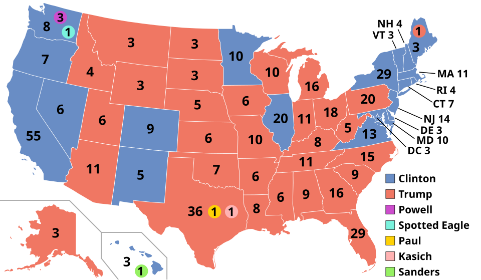
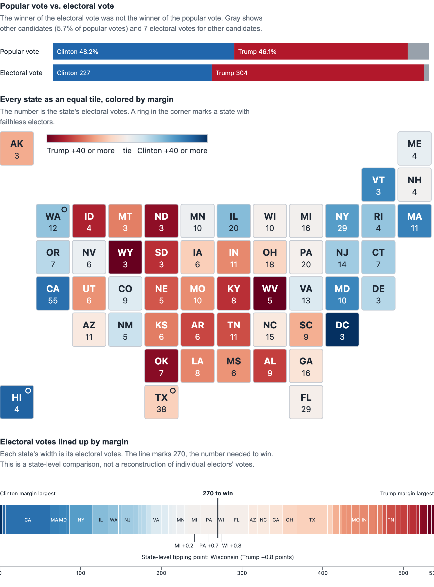

# Visualization Critique and Redesign: The 2016 Electoral Map

## 1. Original visualization and context

The visualization I chose is the presidential election results map in Wikipedia's article on the [2016 United States presidential election](https://en.wikipedia.org/wiki/2016_United_States_presidential_election). It is a geographic map of the fifty states and Washington, D.C., with each state colored blue for Clinton or red for Trump, and the state's electoral votes printed on it. Dots in five additional colors mark seven "faithless" electors who voted for someone other than their state's winner.

The intended message is who won each state and how those wins added up to Trump's 304 electoral votes against Clinton's 227. The audience is general readers of an encyclopedia article, who need to identify a state's winner, compare regions, and see the overall pattern.

## 2. Critique

**Strengths.**
1. *Winner is readable at a glance.* Blue and red follow a widely understood convention, so readers familiar with U.S. election maps can identify the winner quickly.
2. *Direct labeling.* Electoral votes are printed on each state, which removes the need to look values up in a table.

**Weaknesses.**
1. *Area encodes land, not electoral votes.* Montana and Wyoming take up far more space than New Jersey, yet have fewer electoral votes (3 each vs. 14). Small northeastern states need leader lines to be readable. Geography is useful for locating states, but land area can mislead comparisons of electoral influence.
2. *Binary color discards the margin.* Michigan (Trump by 0.2 points) and Wyoming (Trump by 46 points) look identical. Color is being used for a category when the data has a quantitative margin. This hides that the election turned on a few close states.
3. *The faithless-elector marks are hard to decode.* Five extra colors and tiny dots crowd the states they sit on, and the reader must match them to a legend.
4. *No national context.* The map shows only the electoral outcome, not the popular vote, which Clinton won by about 2.87 million votes.

## 3. Redesign rationale

My redesign, built in D3.js from FEC state totals, has three parts, with linked state views: a popular-vote-versus-electoral-vote bar, a tile-grid map, and a strip of electoral votes ordered by margin.

**Decision 1: equal tiles instead of geography.** I replaced the map with one equal-size tile per state, arranged in a schematic layout, with electoral votes printed on each tile. This addresses weakness 1: every state now gets the same visual weight, and the northeastern states are as legible as Texas. 

**Decision 2: color by margin.** I colored tiles with a diverging scale from deep red through white to deep blue, capped at 40 points. This addresses weakness 2. Close states are now nearly white, and blowouts are saturated, so the swing states stand out without any annotation.

**Decision 3: a strip ordered by margin, with a 270 line.** States are lined up from largest Clinton margin to largest Trump margin, each with a width equal to its electoral votes. A line marks 270, and the state that crosses it (Wisconsin) is labeled as the tipping point.  

**Decision 4: add the popular vote and simplify the faithless-elector mark.** A pair of stacked bars compares popular vote share (Clinton 48.2%, Trump 46.1%) with electoral vote share (227 vs. 304, with 7 faithless). This addresses weakness 4. Faithless electors are shown as one ring on the tile, with the names in a tooltip, which addresses weakness 3. Hovering over a state in either view highlights it in the other.

## 4. Original vs. redesign

Finding the closest states, judging how narrow Trump's margin was in the decisive states, and seeing where the 270th vote fell were hard or impossible in the original. Comparing states' electoral weight is no longer distorted by land area, and the popular-versus-electoral gap sits at the top of the page.

There are trade-offs. The tile grid loses real geography, so adjacency is only approximate. Color reflects the two main candidates, so third-party votes are invisible, which matters most in Utah, where an independent received 21.5%. The color scale is capped at 40 points, so lopsided results look alike. The strip groups Maine at its statewide margin and ignores district splits and faithless electors, so its 270 line is a state-level approximation. The national bars use actual votes cast. Finally, tooltips need a mouse, so a screenshot shows less than the live page.

## 5. Figures and references

- Original visualization: Wikipedia, "2016 United States presidential election," https://en.wikipedia.org/wiki/2016_United_States_presidential_election
- Data: Federal Election Commission, *Federal Elections 2016: Election Results for the U.S. President, the U.S. Senate and the U.S. House of Representatives*, December 2017, https://www.fec.gov/resources/cms-content/documents/federalelections2016.pdf
- D3.js, https://d3js.org